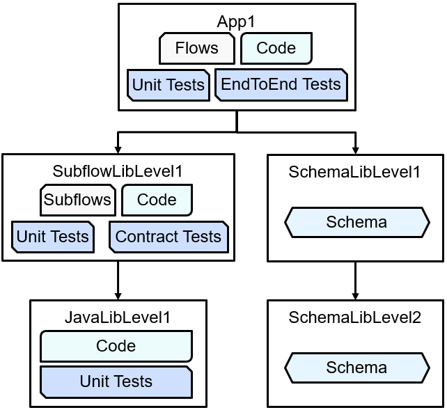

# ace-submodule-javalib-level1

ACE submodule Java library level1

This is the bottom library in a hierarchy of repositories:

Subflow library: https://github.com/trevor-dolby-at-ibm-com/ace-submodule-subflowlib-level1

Originally created for a [blog post](https://community.ibm.com/community/user/integration/blogs/trevor-dolby/2023/04/03/automated-multi-repo-app-connect-enterprise-ace-ba).

This repo is intended to be used as part of the subflow library, and not 
as an independent ACE object. The build uses ant and does not interact with
ACE build tools at this stage.

## Tests

This repo contains unit tests to cover the (very simple) code.

## GitHub Action

Runs the build and test scripts automatically on pull requests.
